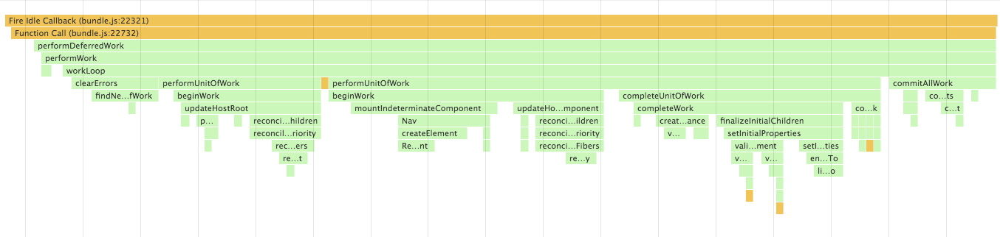
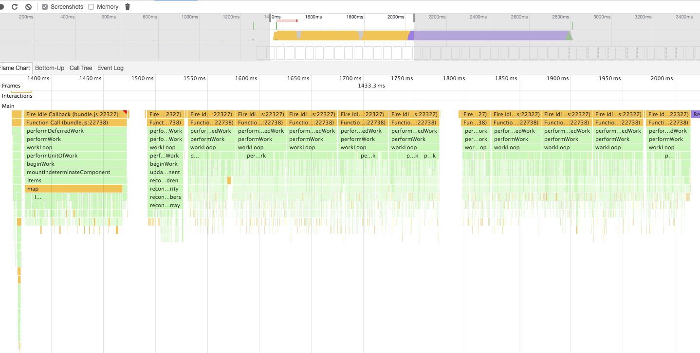
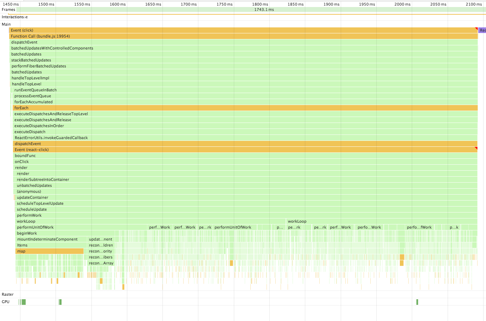
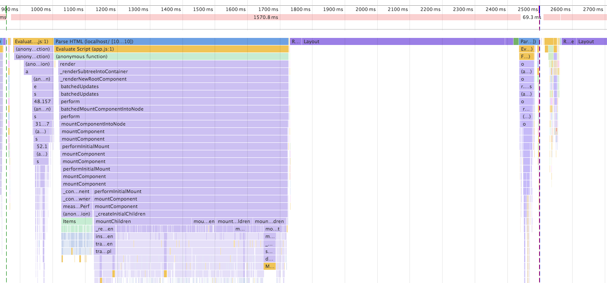

# ReactFiber resources [](CONTRIBUTING.md#pull-requests)

This is for resources for ReactFiber.

ReactFiber is a new React reconciler algorithm, which is in progress.

## Current Status?

* [Is Fiber Ready Yet?](http://isfiberreadyyet.com/)
* :eyes: [Umbrella for remaining features / bugs #7925](https://github.com/facebook/react/issues/7925)

## Test ReactFiber on facebook.com

<blockquote class="twitter-tweet" data-lang="en"><p lang="en" dir="ltr">Want to see Fiber in action? You can now beta test Fiber on Facebook itself! Head over to <a href="https://t.co/5cHyMgk7PL">https://t.co/5cHyMgk7PL</a> for info. <a href="https://t.co/NItNdk1jQK">pic.twitter.com/NItNdk1jQK</a></p>&mdash; React (@reactjs) <a href="https://twitter.com/reactjs/status/822707133024112640">January 21, 2017</a></blockquote>
<script async src="//platform.twitter.com/widgets.js" charset="utf-8"></script>

* https://www.beta.facebook.com/ (facebook.com powered by ReactFiber)
* https://www.facebook.com/groups/reactfiberbeta/ (a public channel for ReactFiber beta testers)


## Try ReactFiber with asynchronous scheduling!

```a
npm i -S react@next react-dom@next
sed -i -e 's/useSyncScheduling: true/useSyncScheduling: false/' node_modules/react-dom/lib/ReactDOMFiber.js
```

## Visualized ReactFiber

* [Fiber Debugger](https://github.com/facebook/react/tree/master/examples/fiber/debugger)

## How to contribute ReactFiber

* https://github.com/facebook/react/issues/7925#issuecomment-259258900

## React internal algorithm

If you are not familiar with React internals, I recommend you to read the documentations, which are very helpful.

* [Codebase Overview](https://facebook.github.io/react/contributing/codebase-overview.html)
* [Implementation Notes](https://facebook.github.io/react/contributing/implementation-notes.html)

## React Fiber

* [ReactFiber](https://github.com/facebook/react/tree/master/src/renderers/shared/fiber)
* [ReactFiberDOM](https://github.com/facebook/react/tree/master/src/renderers/dom/fiber)
* [Example](https://github.com/facebook/react/tree/master/examples/fiber)

## Articles & Slides

* [React Fiber Architecture](https://github.com/acdlite/react-fiber-architecture)
* [Fiber Principles: Contributing To Fiber #7942](https://github.com/facebook/react/issues/7942)
* [How React Fiber Works](https://www.facebook.com/groups/2003630259862046/permalink/2054053404819731/)
* [React Internals](https://zackargyle.github.io/react-internals-slides/)


## Videos

* [Andrew Clark: What's Next for React — ReactNext 2016](https://www.youtube.com/watch?v=aV1271hd9ew)
* [Why, What, and How of React Fiber with Dan Abramov and Andrew Clark](https://www.youtube.com/watch?v=crM1iRVGpGQ)

## ReactFiber function call stacks

**[Note]** ReactFiber now behaves as synchlonous by default. See [#8127](https://github.com/facebook/react/pull/8127).
This call stacks are results in the time when it bahaved as asynclonous.

### ReactDOMFiber



### ReactDOM


### ReactDOMFiber with 10000 items (Async Scheduling)



### ReactDOMFiber with 10000 items (Sync Scheduling)



### ReactDOM with 10000 items



**It's not fair because ReactDOMFiber hasn't implemented features ReactDOM has yet.**

## ReactFiber call tree


## Related Words

* [Fiber](https://en.wikipedia.org/wiki/Fiber_(computer_science))
* [Call Stack](https://en.wikipedia.org/wiki/Call_stack)
* [Coroutine](https://en.wikipedia.org/wiki/Coroutine)
* [Continuation](https://en.wikipedia.org/wiki/Continuation)
* Algebraic Effects
  * [One-shot Delimited Continuations with Effect Handlers](https://esdiscuss.org/topic/one-shot-delimited-continuations-with-effect-handlers)
  * [Effective Concurrency with Algebraic Effects](http://kcsrk.info/ocaml/multicore/2015/05/20/effects-multicore/)
  * [Concurrent & Multicore OCaml: A deep dive](http://kcsrk.info/slides/multicore_fb16.pdf)

## Custom Renderer Interface

You should implement the following interface when create a custom fiber renderer.

* https://github.com/facebook/react/blob/master/src/renderers/shared/fiber/ReactFiberReconciler.js

```js
export type HostConfig<T, P, I, TI, PI, C, CX, PL> = {

  getRootHostContext(rootContainerInstance : C) : CX,
  getChildHostContext(parentHostContext : CX, type : T) : CX,
  getPublicInstance(instance : I | TI) : PI,

  createInstance(
    type : T,
    props : P,
    rootContainerInstance : C,
    hostContext : CX,
    internalInstanceHandle : OpaqueHandle
  ) : I,
  appendInitialChild(parentInstance : I, child : I | TI) : void,
  finalizeInitialChildren(parentInstance : I, type : T, props : P, rootContainerInstance : C) : boolean,

  prepareUpdate(
    instance : I,
    type : T,
    oldProps : P,
    newProps : P,
    rootContainerInstance : C,
    hostContext : CX
  ) : null | PL,
  commitUpdate(
    instance : I,
    updatePayload : PL,
    type : T,
    oldProps : P,
    newProps : P,
    internalInstanceHandle : OpaqueHandle
  ) : void,
  commitMount(instance : I, type : T, newProps : P, internalInstanceHandle : OpaqueHandle) : void,

  shouldSetTextContent(props : P) : boolean,
  resetTextContent(instance : I) : void,

  createTextInstance(
    text : string,
    rootContainerInstance : C,
    hostContext : CX,
    internalInstanceHandle : OpaqueHandle
  ) : TI,
  commitTextUpdate(textInstance : TI, oldText : string, newText : string) : void,

  appendChild(parentInstance : I | C, child : I | TI) : void,
  insertBefore(parentInstance : I | C, child : I | TI, beforeChild : I | TI) : void,
  removeChild(parentInstance : I | C, child : I | TI) : void,

  scheduleAnimationCallback(callback : () => void) : number | void,
  scheduleDeferredCallback(callback : (deadline : Deadline) => void) : number | void,

  prepareForCommit() : void,
  resetAfterCommit() : void,

  useSyncScheduling ?: boolean,
};
```

## Examples

* https://koba04.github.io/react-fiber-resources/examples/


## PRs

* https://github.com/facebook/react/pulls?utf8=%E2%9C%93&q=is%3Apr%20Fiber


## Issues

| No | Title | Author | Status |
| --- | ----- | ------ | ------ |
| [#8238](https://github.com/facebook/react/issues/8238) | Handle errors in callbacks | [@acdlite](https://github.com/acdlite) | |
| [#8181](https://github.com/facebook/react/issues/8181) | Error handling | [@gaearon](https://github.com/gaearon) | |
| [#8012](https://github.com/facebook/react/issues/8012) | Formalize States | [@sebmarkbage](https://github.com/sebmarkbage) | |
| [#7942](https://github.com/facebook/react/issues/7942) | Fiber Principles: Contributing To Fiber | [@sebmarkbage](https://github.com/sebmarkbage) | |
| [#7925](https://github.com/facebook/react/issues/7925) | Umbrella for remaining features / bugs | [@sebmarkbage](https://github.com/sebmarkbage) | |
| [#7906](https://github.com/facebook/react/issues/7906) | Spill-over from child reconciliation | [@sebmarkbage](https://github.com/sebmarkbage) | |

:heavy_check_mark: is a closed Issue.
