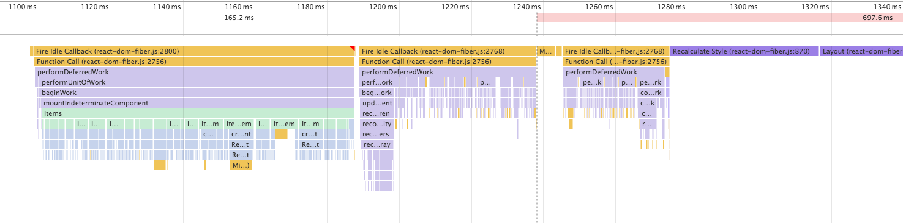
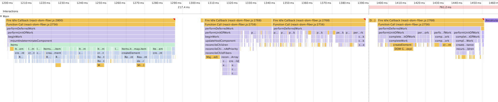

# ReactFiber resources [](CONTRIBUTING.md#pull-requests)

This is for resources for ReactFiber.

ReactFiber is a new React reconciler algorithm, which is in progress.

## Current Status?

* [Is Fiber Ready Yet?](http://isfiberreadyyet.com/)
* :eyes: [Umbrella for remaining features / bugs #7925](https://github.com/facebook/react/issues/7925)

## How to contribute ReactFiber

* https://github.com/facebook/react/issues/7925#issuecomment-259258900

## React internal algorithm

If you are not familiar with React internals, I recommend you to read the documentations, which are very helpful.

* [Codebase Overview](https://facebook.github.io/react/contributing/codebase-overview.html)
* [Implementation Notes](https://facebook.github.io/react/contributing/implementation-notes.html)

## React Fiber

* [ReactFiber](https://github.com/facebook/react/tree/master/src/renderers/shared/fiber)
* [ReactFiberDOM](https://github.com/facebook/react/tree/master/src/renderers/dom/fiber)
* [Example](https://github.com/facebook/react/tree/master/examples/fiber)

## Articles

* [React Fiber Architecture](https://github.com/acdlite/react-fiber-architecture)
* [Fiber Principles: Contributing To Fiber #7942](https://github.com/facebook/react/issues/7942)
* [How React Fiber Works](https://www.facebook.com/groups/2003630259862046/permalink/2054053404819731/)


## Videos

* [Andrew Clark: What's Next for React — ReactNext 2016](https://www.youtube.com/watch?v=aV1271hd9ew)

## ReactFiber function call stacks

**[Note]** ReactFiber now behaves as synchlonous by default. See [#8127](https://github.com/facebook/react/pull/8127).
This call stacks are results in the time when it bahaved as asynclonous.

### ReactDOMFiber


### ReactDOMFiber with 10000 items



* set `hidden` props 9000 items

```js
var Items = () => (
  $('ul', {},
    items.map(item => $('li', {key: item.index, hidden: item.index > 1000 ? true : false}, item.name))
  )
);
```



### ReactDOM with 10000 items


**It's not fair because ReactDOMFiber hasn't implemented features ReactDOM has yet.**

## ReactFiber call tree


## Related Words

* [Fiber](https://en.wikipedia.org/wiki/Fiber_(computer_science))
* [Call Stack](https://en.wikipedia.org/wiki/Call_stack)
* [Coroutine](https://en.wikipedia.org/wiki/Coroutine)
* [Continuation](https://en.wikipedia.org/wiki/Continuation)
* Algebraic Effects
  * [One-shot Delimited Continuations with Effect Handlers](https://esdiscuss.org/topic/one-shot-delimited-continuations-with-effect-handlers)
  * [Effective Concurrency with Algebraic Effects](http://kcsrk.info/ocaml/multicore/2015/05/20/effects-multicore/)
  * [Concurrent & Multicore OCaml: A deep dive](http://kcsrk.info/slides/multicore_fb16.pdf)


## Examples

* https://koba04.github.io/react-fiber-resources/examples/


## PRs

| No | Title | Author | Status |
| --- | ----- | ------ | ------ |
| [#8400](https://github.com/facebook/react/pull/8400) | Update root children using appendChild/insertBefore/removeChild | [@sebmarkbage](https://github.com/sebmarkbage) | |
| [#8386](https://github.com/facebook/react/pull/8386) | Add ReactDOMFiber.unstable_createPortal() | [@gaearon](https://github.com/gaearon) | :rocket: |
| [#8371](https://github.com/facebook/react/pull/8371) | Handle Bailed Out HostText update and MultiChildText test | [@sebmarkbage](https://github.com/sebmarkbage) | |
| [#8368](https://github.com/facebook/react/pull/8368) | renderSubtreeIntoContainer | [@spicyj](https://github.com/spicyj) | :rocket: |
| [#8361](https://github.com/facebook/react/pull/8361) | React Native Fiber | [@edvinerikson](https://github.com/edvinerikson) | |
| [#8349](https://github.com/facebook/react/pull/8349) | Fix ReactDOMFiberSelect to set the initial values | [@sebmarkbage](https://github.com/sebmarkbage) | :rocket: | 
| [#8347](https://github.com/facebook/react/pull/8347) | Handle controlled components | [@sebmarkbage](https://github.com/sebmarkbage) | :rocket: | 
| [#8337](https://github.com/facebook/react/pull/8337) | Subtrees and portals | [@gaearon](https://github.com/gaearon) | :heavy_check_mark: |
| [#8334](https://github.com/facebook/react/pull/8334) | Make numerical refs work in Fiber | [@spicyj](https://github.com/spicyj) | :rocket: |
| [#8331](https://github.com/facebook/react/pull/8331) | Clear existing text content before inserting children | [@acdlite](https://github.com/acdlite) | |
| [#8319](https://github.com/facebook/react/pull/8319) | Fork ReactDOMComponent | [@sebmarkbage](https://github.com/sebmarkbage) | :rocket: |
| [#8304](https://github.com/facebook/react/pull/8304) | New error boundary semantics | [@acdlite](https://github.com/acdlite) | |
| [#8290](https://github.com/facebook/react/pull/8290) | Removes UpdateQueueNode.callbackWasCalled | [@acdlite](https://github.com/acdlite) | :rocket: |
| [#8272](https://github.com/facebook/react/pull/8272) | Initial implementation of context | [@gaearon](https://github.com/gaearon) | :rocket: |
| [#8263](https://github.com/facebook/react/pull/8263) | Use ReactDOM.unstable_batchedUpdates in Fiber tests | [@gaearon](https://github.com/gaearon) | :rocket: |
| [#8258](https://github.com/facebook/react/pull/8258) | Fix reactComponentExpect | [@gaearon](https://github.com/gaearon) | :rocket: |
| [#8257](https://github.com/facebook/react/pull/8257) | Fix TestUtils edge cases | [@gaearon](https://github.com/gaearon) | :rocket: |
| [#8247](https://github.com/facebook/react/pull/8247) | Normalize className passed to dom from fiber | [@sdougbrown](https://github.com/sdougbrown) | :heavy_check_mark: |
| [#8243](https://github.com/facebook/react/pull/8243) | Warn when shoulcComponentUpdate returns undefined | [@koba04](https://github.com/koba04) | :rocket: |
| [#8242](https://github.com/facebook/react/pull/8242) | Handles risky callbacks on setState. Fixes | [@ankeetmaini](https://github.com/ankeetmaini) | :rocket: |
| [#8238](https://github.com/facebook/react/issues/8238) | Handle errors in callbacks | [@acdlite](https://github.com/acdlite) | :heavy_check_mark: |
| [#8232](https://github.com/facebook/react/pull/8232) | Add support for Fibers in ReactDOMComponentTree and ReactTreeTraversal | [@sebmarkbage](https://github.com/sebmarkbage) | :rocket: |
| [#8227](https://github.com/facebook/react/pull/8227) | Force rerender a failed tree | [@acdlite](https://github.com/acdlite) | |
| [#8222](https://github.com/facebook/react/issues/8222) | Should Fiber have a root field? | [@acdlite](https://github.com/acdlite) | :heavy_check_mark: |
| [#8216](https://github.com/facebook/react/pull/8216) | WIP context | [@edvinerikson](https://github.com/edvinerikson) | :heavy_check_mark: |
| [#8212](https://github.com/facebook/react/pull/8212) | Add more tests and fix an issue with incremental error handling | [@gaearon](https://github.com/gaearon) | |
| [#8210](https://github.com/facebook/react/pull/8210) | Make error handling more resilient | [@gaearon](https://github.com/gaearon) | :rocket: |
| [#8208](https://github.com/facebook/react/pull/8208) | UpdateQueue test | [@acdlite](https://github.com/acdlite) | :heavy_check_mark: |
| [#8206](https://github.com/facebook/react/pull/8206) | Updates from inside componentDidMount/Update should have Task priority | [@acdlite](https://github.com/acdlite) | :rocket: | 
| [#8202](https://github.com/facebook/react/pull/8202) | Fix reconciling after null | [@spicyj](https://github.com/spicyj) | :rocket: |
| [#8194](https://github.com/facebook/react/pull/8194) | UpdateQueue fixes | [@acdlite](https://github.com/acdlite) | :rocket: | 
| [#8193](https://github.com/facebook/react/pull/8193) | Initial implementation of "Task" priority | [@acdlite](https://github.com/acdlite) | :rocket: |
| [#8187](https://github.com/facebook/react/pull/8187) | Schedule animation regardless of deferred work | [@gaearon](https://github.com/gaearon) | :rocket: |
| [#8186](https://github.com/facebook/react/pull/8186) | Add tests for scheduling inside callbacks | [@gaearon](https://github.com/gaearon) | :rocket: |
| [#8183](https://github.com/facebook/react/pull/8183) | Add more tests for scheduling | [@gaearon](https://github.com/gaearon) | :rocket: |
| [#8173](https://github.com/facebook/react/pull/8173) | Assign ReactTypeOfSideEffect to ReactFiber.Fiber.effectTag correctly | [@saneyuki](https://github.com/saneyuki) | :rocket: |
| [#8172](https://github.com/facebook/react/pull/8172) | Fix infinite loop in scheduler and add more tests | [@gaearon](https://github.com/gaearon) | :rocket: |
| [#8171](https://github.com/facebook/react/pull/8171) | Add some scheduling tests | [@gaearon](https://github.com/gaearon) | :rocket: |
| [#8169](https://github.com/facebook/react/pull/8169) | Track passing/failing tests in fiber | [@spicyj](https://github.com/spicyj) | :rocket: |
| [#8167](https://github.com/facebook/react/pull/8167) | setState inside componentDidMount/Update should be sync and batched |  [@acdlite](https://github.com/acdlite) | :heavy_check_mark: | 
| [#8166](https://github.com/facebook/react/pull/8166) | Errors shouldn't interfere with scheduling | [@gaearon](https://github.com/gaearon) | :heavy_check_mark: |
| [#8156](https://github.com/facebook/react/pull/8156) | Complete ES6 Class related errors support | [@rricard](https://github.com/rricard) | :rocket: |
| [#8155](https://github.com/facebook/react/pull/8155) | Cover all findDOMNode error cases in fiber | [@rricard](https://github.com/rricard) | |
| [#8153](https://github.com/facebook/react/pull/8153) | Remove recursion from error handling | [@gaearon](https://github.com/gaearon) | :heavy_check_mark: |
| [#8152](https://github.com/facebook/react/pull/8152) | Get ReactComponentTreeHook working | [@gaearon](https://github.com/gaearon) | |
| [#8151](https://github.com/facebook/react/pull/8151) | Miscellaneous fixes to get more tests passing | [@gaearon](https://github.com/gaearon) | :rocket: |
| [#8150](https://github.com/facebook/react/pull/8150) | Fix tests for Fiber in ReactElement-test | [@rricard](https://github.com/rricard) | :rocket: |
| [#8149](https://github.com/facebook/react/pull/8149) | Get a few more Fiber tests passing | [@gaearon](https://github.com/gaearon) | :rocket: |
| [#8148](https://github.com/facebook/react/pull/8148) | Rewrite some tests relying on internal APIs | [@gaearon](https://github.com/gaearon) | :rocket: |
| [#8147](https://github.com/facebook/react/pull/8147) | Fix TestUtils.findAllInRenderedTree | [@gaearon](https://github.com/gaearon) | :rocket: |
| [#8146](https://github.com/facebook/react/pull/8146) | Attempt to fix ReactDOMTextComponent test in Fiber | [@rricard](https://github.com/rricard) | :rocket: |
| [#8128](https://github.com/facebook/react/pull/8128) | Some early refactoring to be able to reuse the event system | [@sebmarkbage](https://github.com/sebmarkbage) | :rocket: |
| [#8127](https://github.com/facebook/react/pull/8127) |  Use synchronous scheduling by default | [@acdlite](https://github.com/acdlite) | :rocket: | 
| [#8118](https://github.com/facebook/react/pull/8118) | PureComponent | [@acdlite](https://github.com/acdlite) | :rocket: | 
| [#8102](https://github.com/facebook/react/pull/8102) |  Add top level render callbacks into ReactDOMFiber and ReactNoop | [@koba04](https://github.com/koba04) | :rocket: |
| [#8099](https://github.com/facebook/react/pull/8099) | String refs and owner tracking | [@acdlite](https://github.com/acdlite) | :rocket: | 
| [#8095](https://github.com/facebook/react/pull/8095) | Full Error Boundaries |  [@gaearon](https://github.com/gaearon) | :rocket: |
| [#8086](https://github.com/facebook/react/pull/8086) | Reorganize files for DOM renderer to make overlap between fiber/stack clearer | [@sebmarkbage](https://github.com/sebmarkbage) | :rocket: |
| [#8085](https://github.com/facebook/react/pull/8085) | Delete child when the key lines up but the type doesn't | [@sebmarkbage](https://github.com/sebmarkbage) | :rocket: |
| [#8083](https://github.com/facebook/react/pull/8083) | Implement findDOMNode and isMounted | [@sebmarkbage](https://github.com/sebmarkbage) | :rocket: |
| [#8072](https://github.com/facebook/react/pull/8072) | Add types for ReactFiber and ReactChildFiber |  [@koba04](https://github.com/koba04) | :rocket: |
| [#8079](https://github.com/facebook/react/pull/8079) | Respect state set in componentWillMount() on resuming | [@gaearon](https://github.com/gaearon) | :rocket: |
| [#8033](https://github.com/facebook/react/pull/8033) | Add Fiber Debugger | [@gaearon](https://github.com/gaearon) | :rocket: |
| [#8055](https://github.com/facebook/react/pull/8055) | Accept className in ReactDOMFiber | [@sebmarkbage](https://github.com/sebmarkbage) | :rocket: |
| [#8029](https://github.com/facebook/react/pull/8029) | Quick fix to the return top level problem | [@sebmarkbage](https://github.com/sebmarkbage) | :rocket: |
| [#8028](https://github.com/facebook/react/pull/8028) | Don't call componentDidUpdate if shouldComponentUpdate returns false | [@sebmarkbage](https://github.com/sebmarkbage) | :rocket: |
| [#8016](https://github.com/facebook/react/pull/8016) | Add unit tests for ReactDOMFiber |  [@koba04](https://github.com/koba04) | :rocket: |
| [#8015](https://github.com/facebook/react/pull/8015) | Add more life-cycles | [@sebmarkbage](https://github.com/sebmarkbage) | :rocket: |
| [#8010](https://github.com/facebook/react/pull/8010) | Some setState related issues | [@sebmarkbage](https://github.com/sebmarkbage) | :rocket: |
| [#8009](https://github.com/facebook/react/pull/8009) | [NFC] Logging protips | [@sebmarkbage](https://github.com/sebmarkbage) | |
| [#8001](https://github.com/facebook/react/pull/8001) | Add a unit test for ReactTopLevelText | [@koba04](https://github.com/koba04) | :rocket: |
| [#7993](https://github.com/facebook/react/pull/7993) | Initial error boundaries | [@gaearon](https://github.com/gaearon) | :heavy_check_mark: |
| [#7992](https://github.com/facebook/react/pull/7992) | Set DOM attributes | [@gaearon](https://github.com/gaearon) | :heavy_check_mark: |
| [#7972](https://github.com/facebook/react/pull/7972) | Support to render number as children | [@koba04](https://github.com/koba04) | :heavy_check_mark: |
| [#7941](https://github.com/facebook/react/pull/7941) | State Updates | [@sebmarkbage](https://github.com/sebmarkbage) | :rocket: |
| [#7707](https://github.com/facebook/react/pull/7707) | Child Reconciliation, Refs and Life-Cycles | [@sebmarkbage](https://github.com/sebmarkbage) | :rocket: |
| [#7636](https://github.com/facebook/react/pull/7636) | Refactor Pending Work Phase and Progressed Work | [@sebmarkbage](https://github.com/sebmarkbage) | :rocket: |
| [#7466](https://github.com/facebook/react/pull/7466) | Animation priority work | [@acdlite](https://github.com/acdlite) | :rocket: |
| [#7457](https://github.com/facebook/react/pull/7457) | Separate priority field for pending updates | [@acdlite](https://github.com/acdlite) | :heavy_check_mark: |
| [#7448](https://github.com/facebook/react/pull/7448) | Fix initial mount starvation problems | [@sebmarkbage](https://github.com/sebmarkbage) | :heavy_check_mark: |
| [#7344](https://github.com/facebook/react/pull/7344) | setState | [@acdlite](https://github.com/acdlite) | :rocket: |
| [#7248](https://github.com/facebook/react/pull/7248) | Various minor tweaks and a few big ones | [@sebmarkbage](https://github.com/sebmarkbage) | :rocket: |
| [#7180](https://github.com/facebook/react/pull/7180) | [Not for commit] Sierpinski Triangle Demo | [@sebmarkbage](https://github.com/sebmarkbage) | |
| [#7154](https://github.com/facebook/react/pull/7154) | Host Side Effects | [@sebmarkbage](https://github.com/sebmarkbage) | :rocket: |
| [#7034](https://github.com/facebook/react/pull/7034) | Host Container Fiber and Priority Levels | [@sebmarkbage](https://github.com/sebmarkbage) | :rocket: |
| [#6988](https://github.com/facebook/react/pull/6988) | Minimize abuse of .alternate | [@sebmarkbage](https://github.com/sebmarkbage) | :rocket: |
| [#6981](https://github.com/facebook/react/pull/6981) | Add support for simple updates and fiber pooling | [@sebmarkbage](https://github.com/sebmarkbage) | :rocket: |
| [#6903](https://github.com/facebook/react/pull/6903) | Transfer everything from Element onto the Fiber and use Tag instead of Stage | [@sebmarkbage](https://github.com/sebmarkbage) | :rocket: |
| [#6859](https://github.com/facebook/react/pull/6859) | Child Reconciler + New Coroutines Primitive | [@sebmarkbage](https://github.com/sebmarkbage) | :rocket: |

:rocket: is a merged PR.
:heavy_check_mark: is a closed PR.

## Issues

| No | Title | Author | Status |
| --- | ----- | ------ | ------ |
| [#8238](https://github.com/facebook/react/issues/8238) | Handle errors in callbacks | [@acdlite](https://github.com/acdlite) | | 
| [#8181](https://github.com/facebook/react/issues/8181) | Error handling | [@gaearon](https://github.com/gaearon) | |
| [#8012](https://github.com/facebook/react/issues/8012) | Formalize States | [@sebmarkbage](https://github.com/sebmarkbage) | |
| [#7942](https://github.com/facebook/react/issues/7942) | Fiber Principles: Contributing To Fiber | [@sebmarkbage](https://github.com/sebmarkbage) | |
| [#7925](https://github.com/facebook/react/issues/7925) | Umbrella for remaining features / bugs | [@sebmarkbage](https://github.com/sebmarkbage) | |
| [#7906](https://github.com/facebook/react/issues/7906) | Spill-over from child reconciliation | [@sebmarkbage](https://github.com/sebmarkbage) | |

:heavy_check_mark: is a closed Issue.
